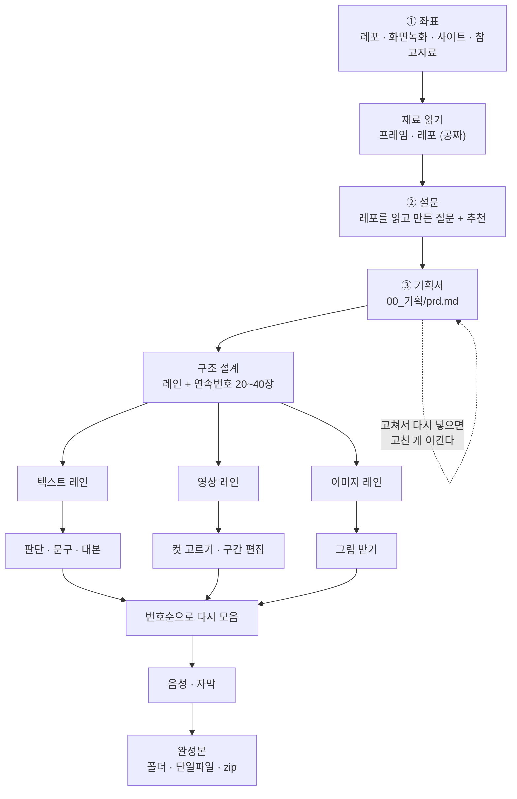
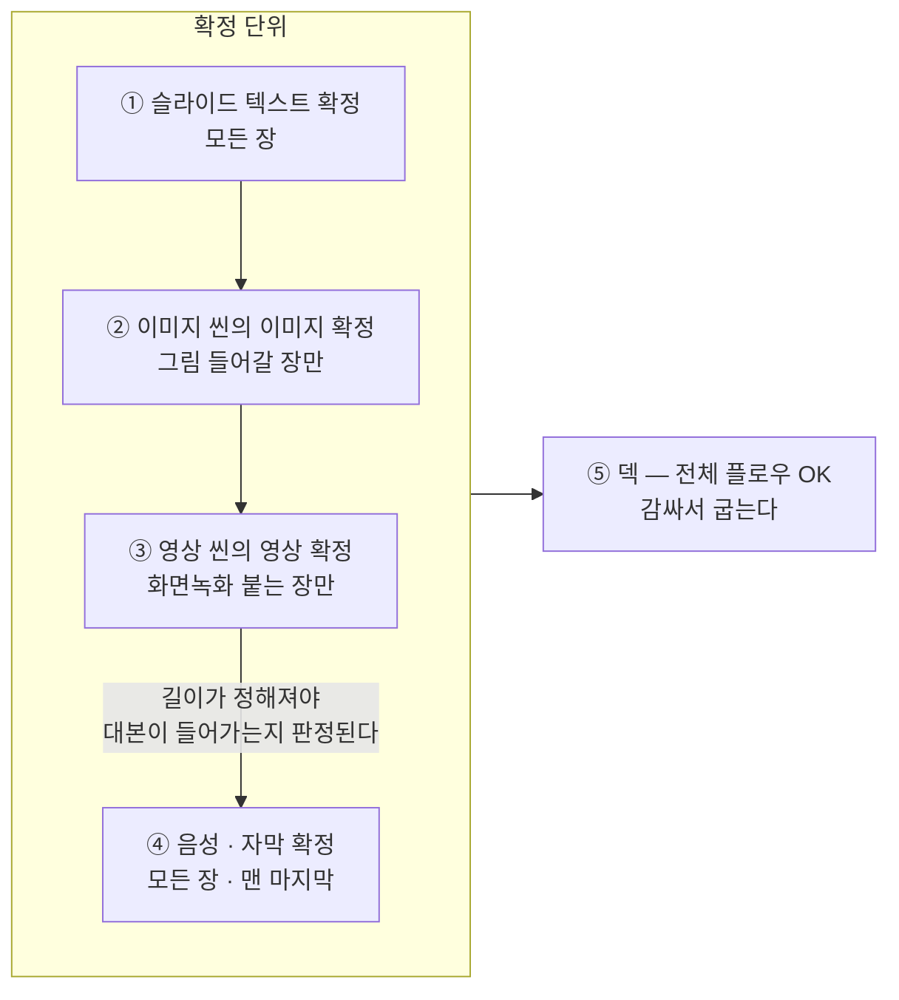
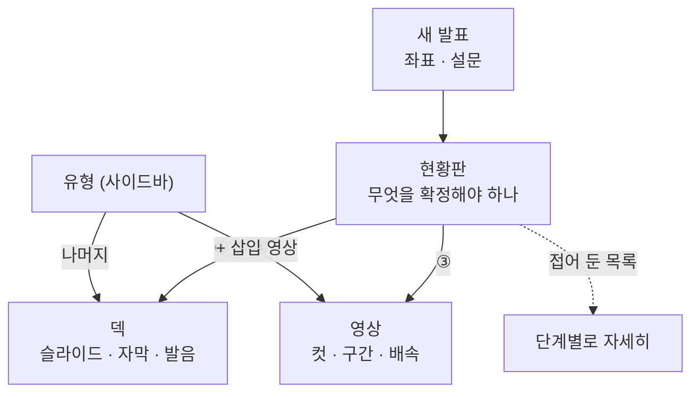
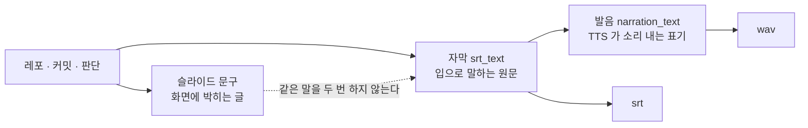
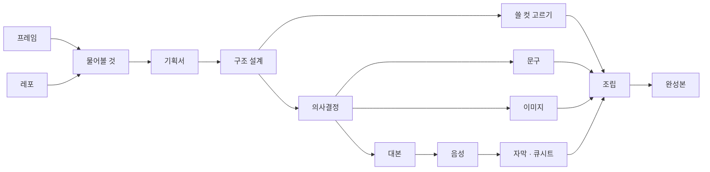
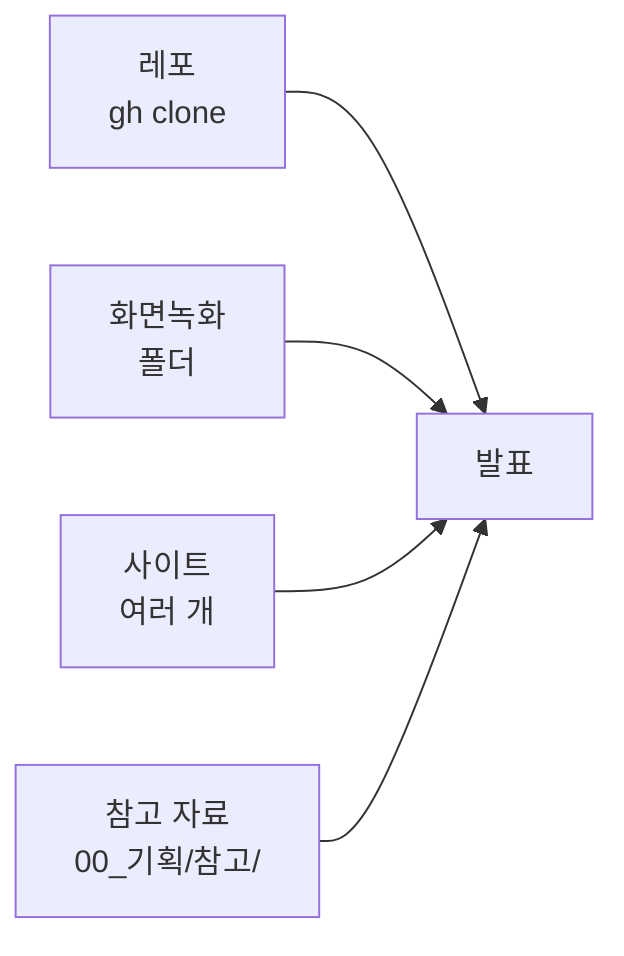
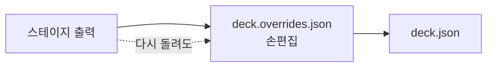

# 흐름

이 앱이 무엇을 어떤 순서로 하는지. 화면과 파이프라인이 어떻게 맞물리는지.

---

## 1. 전체 흐름

**팬아웃 → 팬인.** 레인을 나누는 이유는 만드는 비용이 다르기 때문이다.
텍스트는 쉽고, 영상과 그림은 오래 걸린다. 따로 만들고 번호로 합친다.

---

## 2. 확정 단위 — 현황판이 보여 주는 것

**확정이란 "이대로 나가도 된다" 고 사람이 찍는 것이다.** 단계가 돌았는지(재료가
생겼는지)와 사람이 봤는지는 다르다. 현황판은 **장 단위**로 센다.

| # | 확정 | 대상 | 확정 표시 | 어디서 |
|---|---|---|---|---|
| ① | 슬라이드 텍스트 | 모든 장 | `화면` 버튼 | 덱 |
| ② | 이미지 씬의 이미지 | `text_image` 장 | 그림 파일 도착 | 참고 폴더에 번호로 |
| ③ | 영상 씬의 영상 | `video_id` 있는 장 | `무음` 버튼 | 영상 |
| ④ | 음성 · 자막 | 모든 장 | `대본` 버튼 | 덱 |
| ⑤ | 덱 | 전체 | — | 위 넷이 끝나면 굽는다 |

**④가 맨 마지막인 이유:** 영상 장은 클립이 확정돼야 길이가 정해지고, 길이가
정해져야 대본이 그 안에 들어가는지 판정된다. 순서를 뒤집으면 대본을 확정하고
나서 영상을 자르게 되고, 그럼 대본을 다시 봐야 한다.

---

## 3. 화면

화면은 셋뿐이다(새 발표 · 현황판 · 덱, 그리고 영상). **단계 이름은 메뉴에 없다** —
만든 사람만 읽는 말이라서 현황판 안 "단계별로 자세히" 로 접어 뒀다.

### 유형 = 미디어 종류

주제(무엇을 만들었나 · 움직이는 화면 …)가 아니다. 주제는 프로젝트마다 달라 외울 수
없고, 정작 손이 가는 단위는 **"텍스트만인가 / 그림이 붙나 / 영상이 붙나"** 다.
만드는 비용이 거기서 갈린다.

| 유형 | 뜻 | 손이 가는 일 | 첫 프로젝트 |
|---|---|---|---|
| 슬라이드 텍스트 | 문구만 | 문구 보기 | 11장 · `1,3,7,13,17…` |
| + 삽입 이미지 | 그림이 붙는 장 | 그림을 만들어 번호로 넣기 | 8장 · `5,10,16,21…` |
| + 삽입 영상 | 화면녹화가 붙는 장 | 자르고 배속하고 길이 맞추기 | 9장 · `2,6,8,11…` |
| + 코드 | 근거 목록이 주인공 | 경로가 실존하는지 | 9장 · `4,9,12,15…` |

**번호가 섞여 있다.** 같은 유형이 연속으로 붙으면 발표가 지루해지므로 구조 설계가
일부러 흩는다. 현황판의 확정 단위와 **같은 축**이라 세는 기준이 하나다.

---

## 4. 세 가지 텍스트는 서로 다르다

이걸 섞으면 발표가 교안 낭독이 된다.

| | 무엇 | 예 | 만드는 곳 |
|---|---|---|---|
| 슬라이드 문구 | 화면에 박히는 글 | `내 경력을 6개 축으로 볼 수 있습니다` | 문구 단계 (문체 선택) |
| 자막 `srt_text` | 입으로 말하는 원문 | `2vCPU 에서 CPU 1초` | 대본 단계 |
| 발음 `narration_text` | TTS 가 읽는 표기 | `투 브이씨피유 에서 씨피유 일 초` | 대본 단계 |

---

## 5. 파이프라인 13단계

| 단계 | 하는 일 | 종류 | 실측 비용 |
|---|---|---|---|
| 프레임 | ffmpeg 씬 변화 상대 피크로 컷 뽑기 | 결정론 | — |
| 레포 | `gh` shallow clone · 비밀 제거 · 트리 · 커밋 | 결정론 | — |
| **물어볼 것** | 레포를 읽고 이 프로젝트에 맞는 질문 + 추천 | Claude | $0.32 |
| **기획서** | 누구에게 무엇을 팔지 · **준비할 자료 목록** | Claude | ~$0.5 |
| **구조 설계** | 레인 + 연속번호 20~40장. **여기가 핵심** | Claude | $0.96 |
| 쓸 컷 고르기 | 영상 레인이 쓸 컷만 ✓ (비전) | Claude | $0.33 |
| 의사결정 | 레포를 읽고 **무엇을 포기했는지** | Claude | $3.32 |
| **문구** | 문체만 갈아 끼움 — 광고 / 개조식 / 설명문 | Claude | $0.73 |
| 대본 | 자막 + **발음대본** | Claude | $1.22 |
| 이미지 | 프롬프트 내보내고 PNG 를 번호로 되받음 | 결정론 | — |
| 음성 | voicewright / Supertonic-3 (별도 venv) | 외부 | — |
| 자막 · 큐시트 | SRT + 큐시트 md/csv | 결정론 | — |
| 조립 · 완성본 | 번호로 모으고 · 폴더 · 단일파일 · zip | 결정론 | — |

**Claude 단계는 stale 이어도 자동 실행되지 않는다.** 돈은 명시적 클릭에만 쓴다.

---

## 6. 재료가 들어오는 문 넷

**참고 자료 폴더**가 마지막 문이다. 레포에도 영상에도 없는 재료가 여기 산다:

| 넣는 것 | 어떻게 쓰이나 |
|---|---|
| 구조 설명 HTML · 기획 메모 | 텍스트로 뽑아 기획서 · 구조 설계 브리프에 실림 |
| 화면 캡처 이미지 | **파일명이 번호로 시작하면 그 장에 붙는다** (`005.png` · `5-대시보드.png`) |

기획서가 "이 캡처가 필요합니다" 라고 하면 **같은 폴더에 넣으면 된다.**
요청과 납품이 한 자리에 있어야 잊히지 않는다.

---

## 7. 손편집이 항상 이긴다

`10_덱/deck.overrides.json` 이 스테이지 결과 **위에** 얹힌다. 문구·대본·판단을
다시 돌려도 손으로 고친 자막·문구·✓·영상 구간·확정 표시는 살아남는다.
이게 없으면 "좋은 결과 나올 때까지 주사위 굴리기" 가 된다.

---

## 8. 하지 않는 것

| | 왜 |
|---|---|
| 다른 앱과 프로세스를 잇지 않는다 | 이미지 앱은 ChatGPT OAuth, 이 앱은 Claude 구독. 인증 주체가 다른 걸 코드로 이으면 사고가 난다. **접점은 폴더 하나** |
| 통합 mp4 를 만들지 않는다 | 페이지를 재생하며 화면녹화하면 된다. 배속·삭제가 자유롭고 내레이션을 기다려 멈춰도 된다 |
| 영상을 재인코딩하지 않는다 | 재생기가 구간·배속·삭제를 따른다. 고치는 즉시 확인되고 편집 화면과 산출물이 같은 코드로 돈다 |
| LAN 공유를 하지 않는다 | 호스트의 Claude 구독으로 돈다 |
| API 키를 쓰지 않는다 | 환경변수의 `ANTHROPIC_API_KEY` 는 무력화한다 |
| 에이전트가 네트워크를 만지지 않는다 | 레포는 호스트가 clone 하고 Claude 는 `Read`/`Grep`/`Glob` 만 |
